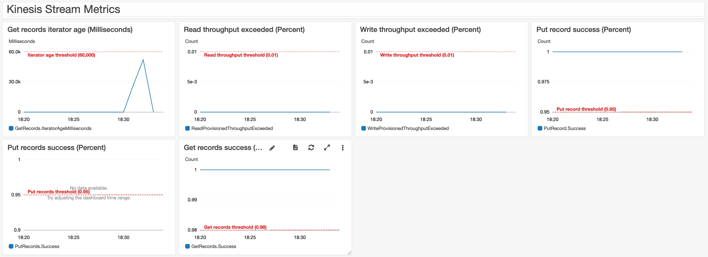
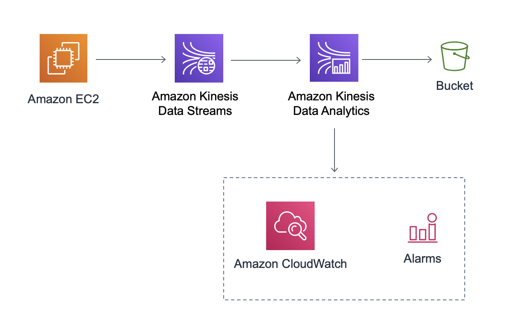
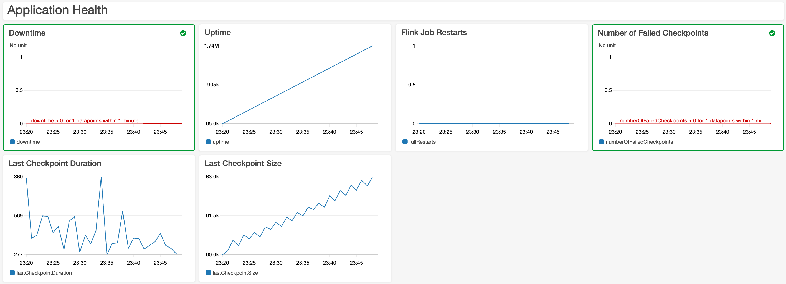

# AWS Streaming Data Solution for Amazon Kinesis
Streaming data use cases follow a similar pattern where data flows from data producers through streaming storage and data consumers to storage destinations. Sources continuously generate data, which is delivered via the ingest stage to the stream storage layer, where it's durably captured and made available for streaming processing. The stream processing layer processes the data in the stream storage layer and sends the processed information to a specified destination.

The challenge with these use cases is the set up time and effort that developers require to create the resources and establish the best practices needed by the streaming data services (such as access control, logging capabilities, and data integrations).

The AWS Streaming Data Solution for Amazon Kinesis automatically configures the AWS services necessary to easily capture, store, process, and deliver streaming data. The solution provides common streaming data patterns for you to choose from that can serve as a starting point for solving your use case or to improve existing applications. You can try out new service combinations to implement common streaming data use cases, or use the solution as the basis for your production environment.

## Table of contents
- [Architecture](#architecture)
- [Project structure](#project-structure)
- [Deployment](#deployment)
- [Creating a custom build](#creating-a-custom-build)
- [Additional Resources](#additional-resources)

## Architecture
The solution implements four patterns with more coming soon. All of them use Amazon Kinesis Data Streams for streaming storage, and you can combine and extend the different components (which are built using the AWS CDK) to meet your needs.

### 1st pattern


The first pattern includes an API Gateway REST API that acts as proxy to Kinesis; an Amazon Kinesis Data Stream that stores the data records; an AWS Lambda function that processes records from the data stream; and an Amazon SQS queue that stores metadata about failed records. Also included are [Amazon CloudWatch alarms](https://docs.aws.amazon.com/streams/latest/dev/monitoring-with-cloudwatch.html#kinesis-metric-use) and a dashboard to monitor the data stream health.



### 2nd pattern


The second pattern includes an EC2 instance that generates data using the Kinesis Producer Library; an Amazon Kinesis Data Stream that stores the data records; an Amazon Kinesis Data Analytics application that process the incoming records and saves data to an Amazon S3 bucket. Also included are [Amazon CloudWatch alarms](https://docs.aws.amazon.com/kinesisanalytics/latest/java/monitoring-metrics-alarms.html#monitoring-metrics-alarms-recommended) and a dashboard to monitor the application health / progress, resource utilization, and specific events / errors.



The solution provides a [demo producer application](source/kinesis/kpl-demo), which is configured to write 100 records per second to the data stream. There's also a [demo Java application for Kinesis Data Analytics](source/kinesis/kda-flink-demo), in order to demonstrate how to use Apache Flink sources, sinks, and operators. The schema used is the same one provided in [Getting Started with Amazon Kinesis Data Analytics](https://docs.aws.amazon.com/kinesisanalytics/latest/java/getting-started.html):

```json
{
    "EVENT_TIME": "2020-08-01T12:00:00.000Z",
    "TICKER": "AMZN",
    "PRICE": 50
}
```

By default, the demo producer and consumer applications will not run after the stacks are created. To enable them, follow the steps below:

### 1. Start the Kinesis Data Analytics application
> **Note**: Application name is an output of the CloudFormation stack.

```
aws kinesisanalyticsv2 start-application --application-name <application-name> --run-configuration {}
```

### 2. Start the KPL producer
> **Note**: This command needs to be run from the EC2 instance launched as part of the stack.

> **Note**: Stream name is an output of the CloudFormation stack.

```
sudo java -jar /tmp/aws-kpl-demo.jar <stream-name> <aws-region> <seconds-to-run>
```

### 3rd pattern


The third pattern includes an Amazon Kinesis Data Stream that stores the data records; an Amazon Kinesis Data Firehose delivery stream that buffers data before delivering it to the destination; and an Amazon S3 bucket that stores the output. Also included are [Amazon CloudWatch alarms](https://docs.aws.amazon.com/firehose/latest/dev/monitoring-with-cloudwatch-metrics.html#firehose-cloudwatch-metrics-best-practices) and a dashboard to monitor the delivery stream health.


### 4th pattern


The fourth pattern is similar to the second pattern, but it showcases how to (asynchronously) invoke an external endpoint in a streaming application, which is useful when you want to enrich or filter incoming events. By default, the solution will use a Lambda function, but that can be replaced by any integration supported by API Gateway (such as an [Amazon SageMaker endpoint](https://docs.aws.amazon.com/solutions/latest/constructs/aws-apigateway-sagemakerendpoint.html)).

The solution provides a [demo producer application](https://github.com/aws-samples/amazon-kinesis-replay), which will replay events from an [existing dataset](https://registry.opendata.aws/nyc-tlc-trip-records-pds/) to the data stream. There's also a [demo Java application for Kinesis Data Analytics](source/kinesis/kda-flink-ml), in order to demonstrate how to the [Asynchronous I/O API of Apache Flink](https://ci.apache.org/projects/flink/flink-docs-stable/dev/stream/operators/asyncio.html).

By default, the demo producer and consumer applications will not run after the stacks are created. To enable them, follow the steps below:

### 1. Start the Kinesis Data Analytics application
> **Note**: Application name is an output of the CloudFormation stack.

```
aws kinesisanalyticsv2 start-application --application-name <application-name> --run-configuration {}
```

### 2. Start the producer
> **Note**: This command needs to be run from the EC2 instance launched as part of the stack.

> **Note**: Stream name is an output of the CloudFormation stack.

```
sudo java -jar /tmp/amazon-kinesis-replay-0.1.0.jar -streamName <stream-name> -streamRegion <region> -noWatermark -objectPrefix artifacts/kinesis-analytics-taxi-consumer/taxi-trips-partitioned.json.lz4/dropoff_year=2018/
```

## Project structure
```
├── deployment
│   └── cdk-solution-helper  [Lightweight helper that cleans-up synthesized templates from the CDK]
├── source
│   ├── bin                  [Entrypoint of the CDK application]
│   ├── images               [Assets referenced in the README file]
│   ├── kinesis              [Demo applications for the KPL and Apache Flink]
│   ├── lambda               [Custom resources for features not supported by CloudFormation]
│   ├── lib                  [Constructs for the components of the solution]
│   ├── patterns             [Stack definitions]
│   └── test                 [Unit tests]
```

## Deployment
You can launch this solution with one click from the [solution home page](https://aws.amazon.com/solutions/implementations/aws-streaming-data-solution-for-amazon-kinesis).

> **Please ensure you test the templates before updating any production deployments.**

## Creating a custom build
To customize the solution, follow the steps below:

### Prerequisites
* [AWS Command Line Interface](https://aws.amazon.com/cli/)
* Node.js 12.x or later
* Python 3.8 or later
* Java 1.8 (only required if using Apache Flink)
* Apache Maven 3.1 (only required if using Apache Flink)

> **Note**: The commands listed below will build all patterns. To only include one, you can modify the CDK entrypoint file on `source/bin/streaming-data-solution.ts`

### 1. Download or clone this repo
```
git clone https://github.com/awslabs/aws-streaming-data-solution-for-amazon-kinesis
```

### 2. After introducing changes, run the unit tests to make sure the customizations don't break existing functionality
```
cd ./source
chmod +x ./run-all-tests.sh
./run-all-tests.sh
```

### 3. Build the solution for deployment
> **Note**: In order to compile the solution, the _build-s3_ will install the AWS CDK.

```
ARTIFACT_BUCKET=my-bucket-name     # S3 bucket name where customized code will reside
SOLUTION_NAME=my-solution-name     # customized solution name
VERSION=my-version                 # version number for the customized code

cd ./deployment
chmod +x ./build-s3-dist.sh
./build-s3-dist.sh $ARTIFACT_BUCKET $SOLUTION_NAME $VERSION
```

> **Why doesn't the solution use CDK deploy?** This solution includes a few Lambda functions, and by default CDK deploy will not install any dependencies (it'll only zip the contents of the path specified in _fromAsset_). In future releases, we'll look into leveraging bundling assets using [Docker](https://docs.aws.amazon.com/cdk/api/latest/docs/aws-lambda-readme.html#bundling-asset-code).

> In addition to that, there are also some extra components (such as the demo applications for the KPL and Kinesis Data Analytics) that are implemented in Java, and the _build-s3_ script takes care of packaging them.

### 4. Upload deployment assets to your Amazon S3 buckets
Create the CloudFormation bucket defined above, as well as a regional bucket in the region you wish to deploy. The CloudFormation templates are configured to pull the Lambda deployment packages from Amazon S3 bucket in the region the template is being launched in.

```
aws s3 mb s3://$ARTIFACT_BUCKET --region us-east-1
aws s3 mb s3://$ARTIFACT_BUCKET-us-east-1 --region us-east-1
```

```
aws s3 sync ./global-s3-assets s3://$ARTIFACT_BUCKET/$SOLUTION_NAME/$VERSION --acl bucket-owner-full-control
aws s3 sync ./regional-s3-assets s3://$ARTIFACT_BUCKET-us-east-1/$SOLUTION_NAME/$VERSION --acl bucket-owner-full-control
```

### 5. Launch the CloudFormation template
* Get the link of the template uploaded to your Amazon S3 bucket (created as $ARTIFACT_BUCKET in the previous step)
* Deploy the solution to your account by launching a new AWS CloudFormation stack

## Additional Resources

### Services
- [Amazon Kinesis Data Streams](https://aws.amazon.com/kinesis/data-streams/)
- [Amazon Kinesis Data Analytics](https://aws.amazon.com/kinesis/data-analytics/)
- [AWS Lambda](https://aws.amazon.com/lambda/)

### Other
- [Kinesis Producer Library](https://github.com/awslabs/amazon-kinesis-producer)
- [Amazon Kinesis Replay](https://github.com/aws-samples/amazon-kinesis-replay)
- [Amazon Kinesis Data Analytics Java Examples](https://github.com/aws-samples/amazon-kinesis-data-analytics-java-examples)
- [Flink: Hands-on Training](https://ci.apache.org/projects/flink/flink-docs-master/learn-flink/)
- [Streaming Analytics Workshop](https://streaming-analytics.workshop.aws/flink-on-kda/)
- [Kinesis Scaling Utility](https://github.com/awslabs/amazon-kinesis-scaling-utils)

***

Copyright 2020 Amazon.com, Inc. or its affiliates. All Rights Reserved.

Licensed under the Apache License, Version 2.0 (the "License");
you may not use this file except in compliance with the License.
You may obtain a copy of the License at

    http://www.apache.org/licenses/LICENSE-2.0

Unless required by applicable law or agreed to in writing, software
distributed under the License is distributed on an "AS IS" BASIS,
WITHOUT WARRANTIES OR CONDITIONS OF ANY KIND, either express or implied.
See the License for the specific language governing permissions and
limitations under the License.
