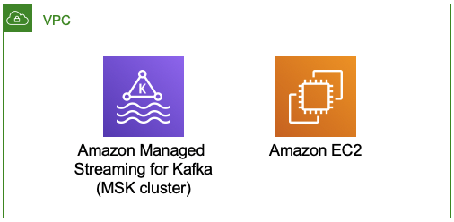
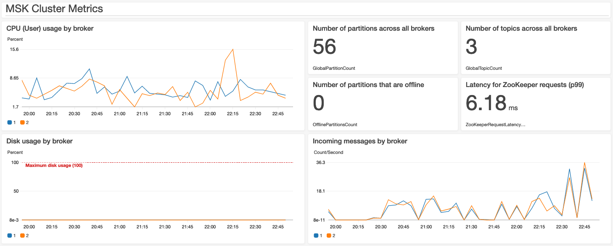
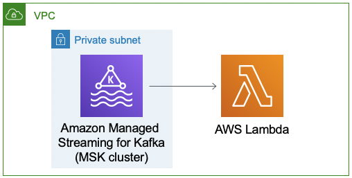
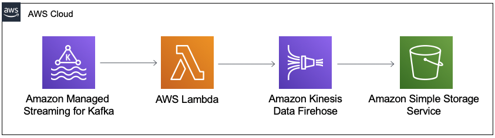
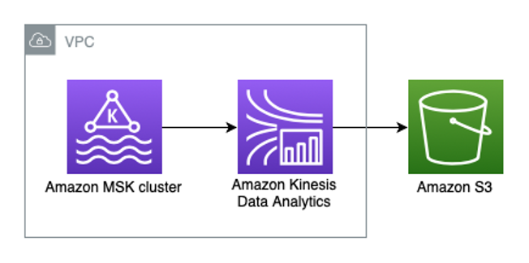

## Architecture for AWS Streaming Data Solution for Amazon MSK
The solution implements four patterns with more coming soon. All of them use Amazon MSK for streaming storage, and you can combine and extend the different components (which are built using the AWS CDK) to meet your needs.

### Networking configuration
We recommend launching the Amazon MSK cluster in private subnets (where the default route points to a NAT gateway), as this networking setup is required if you plan to use AWS Lambda or Amazon Kinesis Data Analytics to read data from the cluster.
For more details, refer to [Adding Amazon MSK as an event source](https://docs.aws.amazon.com/lambda/latest/dg/with-msk.html#services-msk-vpc-config) and [Internet and Service Access for a VPC-Connected Kinesis Data Analytics application](https://docs.aws.amazon.com/kinesisanalytics/latest/java/vpc-internet.html).

If you don't have an Amazon VPC following this pattern, you can use the [Modular and Scalable VPC Architecture](https://aws.amazon.com/quickstart/architecture/vpc/), which provides a networking foundation based on AWS best practices and guidelines.

### 1st pattern


The first pattern includes an Amazon MSK cluster and Amazon EC2 instance that contains the Apache Kafka client libraries required to communicate with the MSK cluster (this client machine will be located on the same Amazon VPC as the cluster, and it can be accessed via AWS Systems Manager Session Manager). Also included is an Amazon CloudWatch dashboard to monitor the cluster health.



Once the stack is launched, you can use the client instance to create an Apache Kafka topic and produce data.

> **Note**: The following commands need to be run from the EC2 instance launched as part of the stack.

> **Note**: Cluster ARN is an output of the CloudFormation stack.

#### 1. Query ZooKeeper connection and Bootstrap servers
Run the _describe-cluster_ CLI command and save the value for the _ZookeeperConnectString_ property:
```
aws kafka describe-cluster --cluster-arn <cluster-arn> --region <aws-region>
```

Run the _get-bootstrap-brokers_ CLI command and save the value for the _BootstrapBrokerString_ property:
```
aws kafka get-bootstrap-brokers --cluster-arn <cluster-arn> --region <aws-region>
```

#### 2. Create topic and produce data
> **Note**: If the command returns an _InvalidReplicationFactorException_, make sure the _replication-factor_ parameter is not larger than the number of available brokers.

> **Note**: The client configuration depends on the access control method selected when launching the stack. For `Unauthenticated access`, use `client-ssl.properties`; for `IAM role-based authentication`, use `client-iam.properties`; and for `SASL/SCRAM`, use `client-sasl.properties`.

```
sudo su
cd /home/kafka/bin

./kafka-topics.sh --create --zookeeper <ZookeeperConnectString> --replication-factor 2 --partitions 1 --topic MyTopic
./kafka-topics.sh --list --bootstrap-server <BootstrapBrokerString> --command-config <ConfigFile>
./kafka-verifiable-producer.sh --bootstrap-server <BootstrapBrokerString> --producer.config <ConfigFile> --topic MyTopic --throughput 100 --max-messages 500
```

> **Note**: For the patterns that use AWS Lambda, the topic must exist before the stack is launched. If it doesn't, no events will be processed.

### 2nd pattern


The second pattern includes an AWS Lambda function that consumes data from an Apache Kafka topic. The [function](/source/lambda/msk-lambda-consumer/index.js) is a Node.js application that logs the received messages, but it can be customized to your business needs.

### 3rd pattern


The third pattern includes an AWS Lambda function that consumes data from an Apache Kafka topic; an Amazon Kinesis Data Firehose delivery stream that buffers data before delivering it to the destination; and an Amazon S3 bucket that stores the output. The [function](/source/lambda/msk-lambda-kdf/index.js) will propagate the messages to Amazon S3 for backup and long term storage.

### 4th pattern


The fourth pattern includes an Amazon Kinesis Data Analytics Studio notebook can be used to process the incoming records from an existing topic in Amazon MSK (using Apache Flink, which guarantees exactly-once processing) and save them to an Amazon S3 bucket.

By default, the notebook will not run after the stack is launched. To start it, run the command below:

> **Note**: Studio notebook name is an output of the CloudFormation stack.

```
aws kinesisanalyticsv2 start-application --application-name <studio-notebook-name>
```

To generate sample records, you can run the following Python script from a client that can connect to the Amazon MSK cluster containing the source topic. The Python client for the Apache Kafka is used, and it must be installed as well (`pip3 install kafka-python`).

> **Note**: Make sure to replace the `<BOOTSTRAP_SERVERS_LIST>`, `<TOPIC_NAME>`, and `<BUCKET_NAME>` placeholders.

```python
from kafka import KafkaProducer
import json, time, random
from datetime import datetime

BOOTSTRAP_SERVERS = '<BOOTSTRAP_SERVERS_LIST>'
producer = KafkaProducer(
    bootstrap_servers=BOOTSTRAP_SERVERS,
    value_serializer=lambda v: json.dumps(v).encode('utf-8'),
    key_serializer=str.encode,
    retry_backoff_ms=500,
    request_timeout_ms=20000,
    security_protocol='SSL')

def get_stock():
    return {
        'event_time': datetime.now().isoformat(),
        'ticker': random.choice(['AAPL', 'AMZN', 'MSFT', 'INTC', 'TBV']),
        'price': round(random.random() * 100, 2)
    }

while True:
    data = get_stock()
    print(data)
    try:
        future = producer.send('<TOPIC_NAME>', value=data, key=data['ticker'])
        producer.flush()

        record_metadata = future.get(timeout=10)
        print('sent event to Kafka! topic {} partition {} offset {}\n'.format(record_metadata.topic, record_metadata.partition, record_metadata.offset))
    except Exception as e:
        print(e.with_traceback())
    time.sleep(0.25)
```

Once records are being produced, you can run queries in the Studio notebook, such as:

```sql
%flink.ssql
CREATE TABLE stock_table (
    ticker VARCHAR(6),
    price DOUBLE,
    event_time TIMESTAMP(3),
    WATERMARK FOR event_time AS event_time - INTERVAL '5' SECOND
) WITH (
    'connector' = 'kafka',
    'topic' = '<TOPIC_NAME>',
    'properties.bootstrap.servers' = '<BOOTSTRAP_SERVERS_LIST>',
    'properties.group.id' = 'KdaStudioGroup',
    'scan.startup.mode' = 'earliest-offset',
    'format' = 'json',
    'json.timestamp-format.standard' = 'ISO-8601',

    'properties.security.protocol' = 'SSL',
    'properties.ssl.truststore.location' = '/usr/lib/jvm/java-11-amazon-corretto/lib/security/cacerts',
    'properties.ssl.truststore.password' = 'changeit'
);
```

> **Note**: In order to write records to S3, you need to [enable checkpointing](https://docs.aws.amazon.com/kinesisanalytics/latest/java/how-zeppelin-checkpoint.html).

```python
%flink.pyflink
st_env.get_config().get_configuration().set_string(
    "execution.checkpointing.interval", "1min"
)

st_env.get_config().get_configuration().set_string(
    "execution.checkpointing.mode", "EXACTLY_ONCE"
)
```

> **Note**: This pattern creates an Amazon S3 bucket, and its name is an output of the CloudFormation stack.

```sql
%flink.ssql(type=update)
CREATE TABLE sink_table_s3 (event_time TIMESTAMP, ticker STRING, price DOUBLE, dt STRING, hr STRING)
PARTITIONED BY (ticker, dt, hr)
WITH ('connector' = 'filesystem', 'path' = 's3a://<BUCKET_NAME>/', 'format' = 'json');

INSERT INTO sink_table_s3
SELECT
    event_time,
    ticker,
    price,
    DATE_FORMAT(event_time, 'yyyy-MM-dd') as dt,
    DATE_FORMAT(event_time, 'HH') as hh
FROM stock_table
WHERE price > 50;
```
